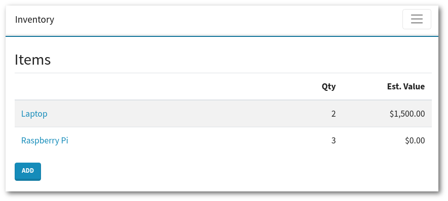
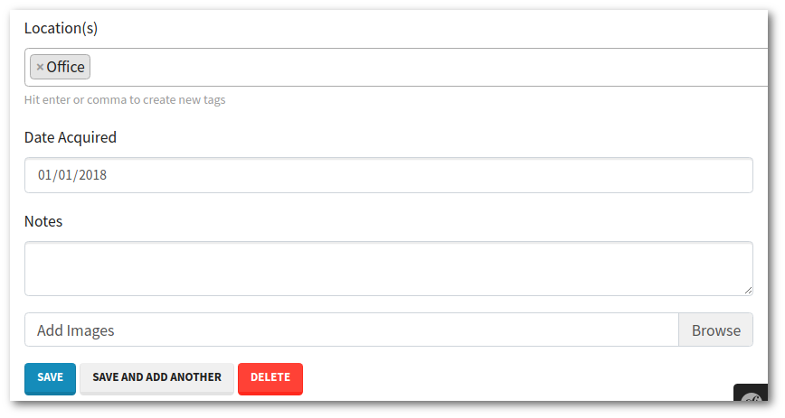

Personal Inventory Web Application
==================================

This is a web application for managing a personal inventory or collection. It's meant to be run on your computer or home network.  It's great for

- Maintaining a home inventory for insurance purposes
- Keeping track of home electronics
- Organizing a coin, stamp, or other collection

Advantages to using this system over a simple spreadsheet:

- Quickly browse by type or location
- Incorporate photos and images
- Comfortabe browsing and editing on a mobile device

Screenshots
-----------

Security
--------

There is no included user authentication, data encryption, or other security. This isn't intended to run on the open internet.  *Caveat emptor*.

Photos
------

To take a photo of an item, simply browse to the site on your mobile device.  When editing an item the "upload photo" button will trigger your device to ask if you'd like to use your camera or pick a photo from your camera roll.

Data Storage
------------

By default data is written to the project's `/data` directory.  This can be changed by editing or overriding the `docker-compose.yaml` file.

Application data is stored using MongoDB in the `/data/db` directory.  Images are stored in the `/data/images` directory.

Running the Application
-----------------------

The only requirement to run the application is docker and docker-compose.  To run the personal inventory manager on a single desktop computer:

1. Run `./bin/setup.sh`. This only needs to be run once or after downloading updates.
1. Run `docker-compose up`.  Add `-d` to run it in the background.
1. Open http://localhost in your favorite browser.

For any other type of setup, such as on a home network server, edit or override the settings in `docker-compose.yaml` and `docker/web/Dockerfile`.  To point to a MongoDB server other than the one included, edit the `.env` file.  For development it's handy to set `APP_ENV=dev` in `.env` to get access to the Symfony framework's profiler and extra debugging info.

TODO
----

In the future we plan on including 

- PDF export useful for insurance purposes
- Links to various online stores to make it easy to order more of an item.  
- Configurable depreciation schedule to estimate current values
